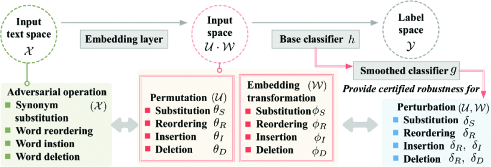
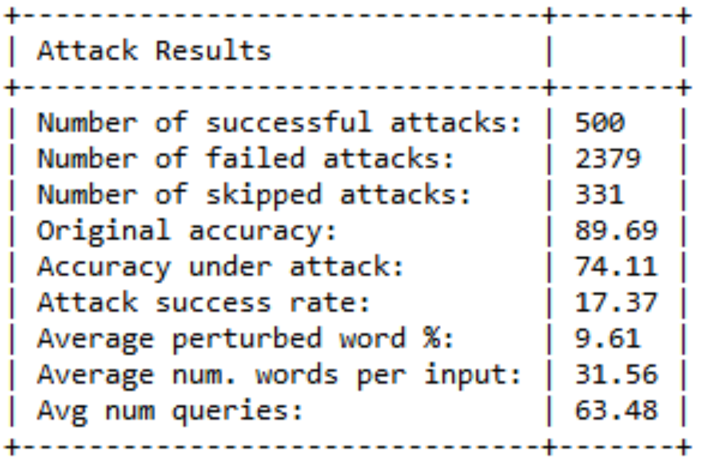
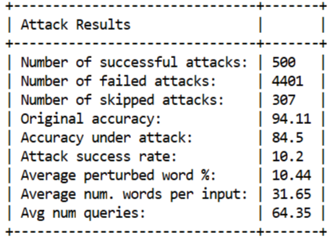
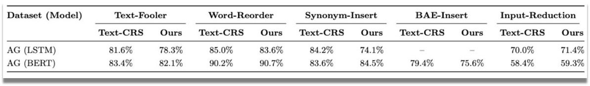

# TextCRS

This repository is the implementation and extension of Text-CRS: A Generalized Certified Robustness Framework against Textual Adversarial Attacks. Project done as part of Clemson CPSC 8570 NTS course.
Group members:
- Danish Bhatkar
- Gaurav Patel
- Sarthak Nikhal
- Mithilesh Biradar

## Installation

Our code is implemented and evaluated on Python 3.9 and PyTorch 1.11.

Install all dependencies: ```pip install -r requirements.txt```



## Usage

### Prepare datasets:

Textual classification datasets have been downloaded in ```/datasets```: AG’s News and IMDB. 
The data/xinyu/results has no data as it has to be downloaded seperately.
Datasets in pickle format can be downloaded from https://drive.google.com/file/d/1YkIDHRc2VwQizK6YTwrTWu9w6Jk3KBWV/view?usp=sharing.

### Repeat experiments:

#### Train 

Select training parameters.

- the noise type (e.g., ```-if_addnoise 5 or 8 or 7 or 4```)
- the model (e.g., ```-model_type lstm or bert or cnn```)
- the dataset (e.g., ```-dataset amazon agnews or amazon or imdb```)

Then, train the smoothed classifier using the following commands:

1. Certified Robustness to Synonym Substitution, noise parameters: ```-syn_size 50, 100, 250``` (i.e., $s$ in Table 4).

```
python textatk_train.py -mode train -dataset amazon -model_type lstm -if_addnoise 5 -syn_size 50
```

2. Certified Robustness to Word Reordering, noise parameters: ```-shuffle_len 64, 128, 256``` (i.e., $2\lambda$ in Table 4).

```
python textatk_train.py -mode train -dataset amazon -model_type lstm -if_addnoise 8 -shuffle_len 256
```

3. Certified Robustness to Word Insertion, noise parameters: ```-noise_sd 0.5, 1.0, 1.5``` (i.e., $\sigma$ in Table 4).

```
python textatk_train.py -mode train -dataset amazon -model_type newbert -if_addnoise 7 -noise_sd 0.5
```

4. Certified Robustness to Word Deletion, noise parameters: ```-beta 0.3, 0.5, 0.7``` (i.e., $p$ in Table 4).

```
python textatk_train.py -mode train -dataset amazon -model_type lstm -if_addnoise 4 -beta 0.3
```

#### Certify 

Choose the noise type (e.g., 5), the model (e.g., lstm), and the dataset (e.g., amazon).

Then, run the corresponding certify ```.sh``` file shell script, e.g., 

```
sh ./run_shell/certify/certify/noise4/lstm_agnews_certify.sh
```

## Adversarial attacks

#### Generate adversarial examples:

The adversarial attack code (```./textattacknew```) has been extended from the [TextAttack project](https://github.com/QData/TextAttack/).

Select the attack parameters. 

- the model (e.g., ```-model_type lstm or bert or cnn```)
- the dataset (e.g., ```-dataset amazon agnews or amazon or imdb```)
- the attack type (e.g., ```-atk textfooler or swap or insert or bae_i or delete```), which corresponds to the five attacks in Table 7
- the number of adversarial examples(e.g., ```-num_examples 500```)

Then, use the following commands to generate adversarial examples:

```
python textatk_attack.py -model_type cnn -dataset amazon -atk textfooler -num_examples 500 -mode test
```

### Attack Test Metrics and Results
The following tables show the evaluation results for the AGNews dataset tested on LSTM and BERT models under 5 different types of attacks.

#### Test results for LSTM on the Agnews dataset for the synonym substitution attack


#### Test results for BERT on the Agnews dataset for the synonym substitution attack


#### Output Comparison with the Original TextCRS framework


#### Certify 

Use the same ```.sh``` shell file above that contains _certify with ae_data_, i.e., add the command ```-ae_data $AE_DATA```.

```
sh ./run_shell/certify/certify/noise4/lstm_agnews_certify.sh
```


## Citation

```
@inproceedings{zhang2023text,
  title={Text-CRS: A Generalized Certified Robustness Framework against Textual Adversarial Attacks},
  author={Zhang, Xinyu and Hong, Hanbin and Hong, Yuan and Huang, Peng and Wang, Binghui and Ba, Zhongjie and Ren, Kui},
  booktitle={2024 IEEE Symposium on Security and Privacy (SP)},
  pages={53--53},
  year={2023},
  organization={IEEE Computer Society}
}
```

## Acknowledgement

[TextAttack](https://github.com/QData/TextAttack)
[Original Repo](https://github.com/Eyr3/TextCRS)


